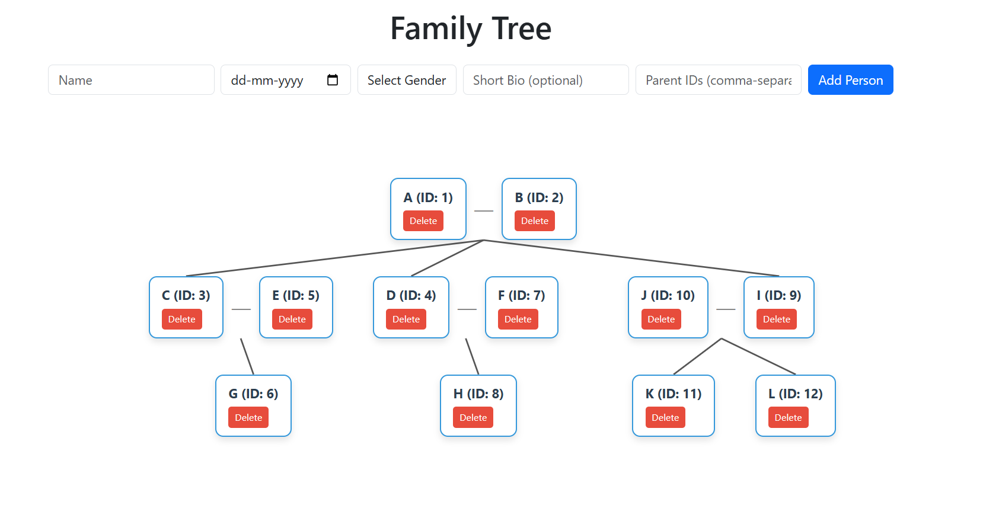
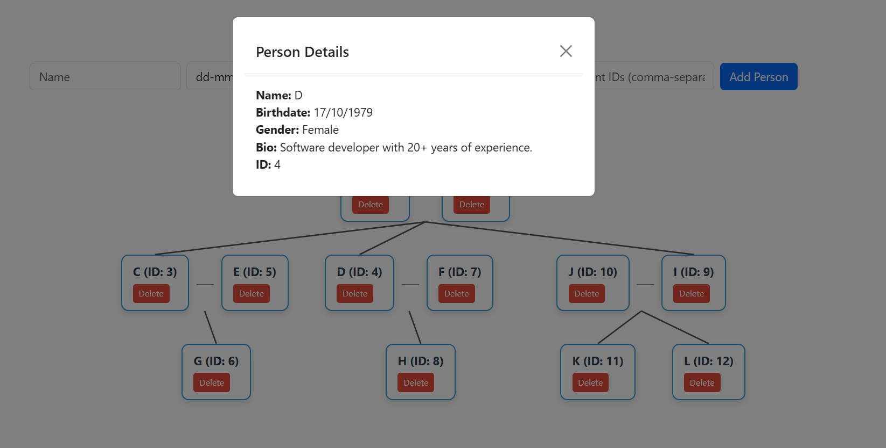

# 🌳 Family Tree Backend

A Spring Boot-based backend service for managing and visualizing family relationships. This API powers a dynamic frontend interface that allows users to create, expand, and explore complex family trees.

---

## 🖼 Preview



---

## 🚀 Features

- ✅ Add a person with or without parents  
- ✅ Parent-child linkage logic  
- ✅ Auto-expand relationships  
- ✅ Filter to show only root nodes initially  
- ✅ RESTful endpoints using DTOs and layered architecture  

---

## 🛠 Tech Stack

| Layer        | Technology                                        |
|--------------|---------------------------------------------------|
| Language     | Java (17+)                                        |
| Framework    | Spring Boot                                       |
| Data Layer   | Spring Data JPA                                   |
| Frontend     | Static HTML + JS (served via `/resources/static`) |
| Build Tool   | Maven                                             |

---

## 📁 Project Structure

```
src/
└── main/
    ├── java/com/example/familytree/
    │   ├── controller/
    │   │   └── PersonController.java
    │   ├── dto/
    │   │   ├── PersonDTO.java
    │   │   └── PersonRequest.java
    │   ├── model/
    │   │   └── Person.java
    │   ├── repository/
    │   │   └── PersonRepository.java
    │   ├── service/
    │   │   └── PersonService.java
    │   └── FamilytreeApplication.java
    └── resources/
        ├── static/
        │   ├── index.html
        │   └── script.js
        └── application.properties
```

---

## 📦 How to Run

### 🧪 Prerequisites
- Java 17+
- Maven

### ▶️ Run Locally

```bash
git clone https://github.com/abisha312/family-tree-backend.git
cd family-tree-backend
./mvnw spring-boot:run
```

The backend will run at:  
👉 `http://localhost:8080`

### 🌐 Access Frontend  
Open:  
`http://localhost:8080/index.html`

---

## 📮 API Endpoints

| Method | Endpoint           | Description             |
|--------|--------------------|-------------------------|
| GET    | /api/persons       | Get all persons         |
| POST   | /api/person        | Add a new person        |

---

## 🙋‍♀️ Author

**Abisha Eunice**  
🎓 CSE @ Sairam Institute of Technology  
📧 [a.abishaeunice@gmail.com](mailto:a.abishaeunice@gmail.com)  
🌐 [Portfolio](https://685acf5b83a91844cfd5ff76--whimsical-starburst-4459cc.netlify.app/main.html)

---

## 📄 License

This project is licensed under the MIT License.

---

## 🌟 Support

If you find this project useful, feel free to ⭐ star the repo and share it!
